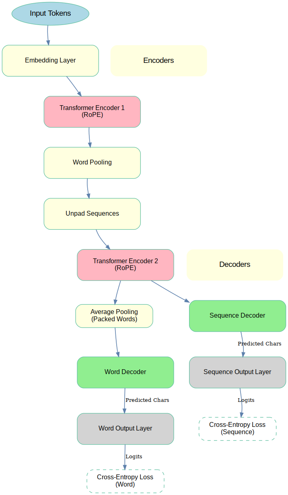
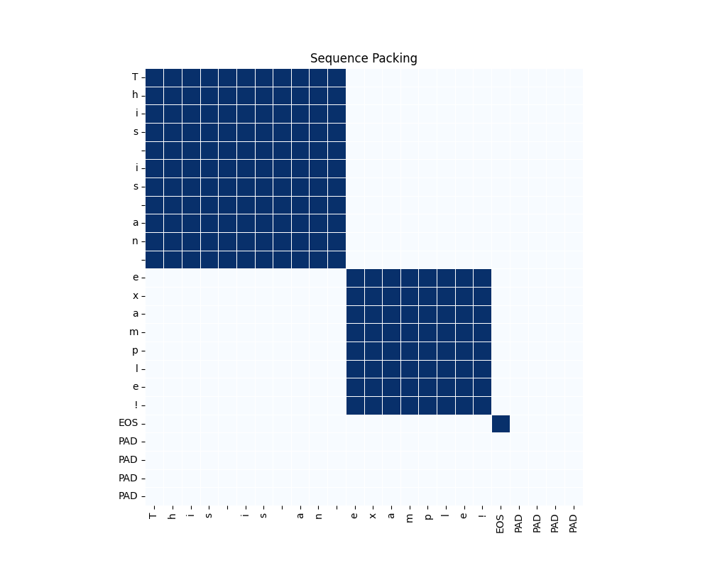

# Encodzall: Masked Denoising Autoencoder

## Overview
Encodzall is a character-level and word-level masked denoising autoencoder. The architecture features two transformer encoders with sequence packing to improve efficiency and word pooling for latent space representations.

### Key Features
- **Sequence Packing**: Input sequences are packed, and the mask restricts attention in Encoder 1 to packed words. These words are pooled per block before being passed to Encoder 2.
- **Masked Pretraining**: Initial training uses character-level and word-level masking. Character-level masking includes individual masks for vowels, consonants, non-whitespace characters, and a general mask that applies to any of these.
- **Reconstruction Losses**: Training objectives include word reconstruction loss and sequence reconstruction loss.
- **Simulated Noise**: After masked pretraining, the model is fine-tuned with simulated noise to mimic OCR defects.
- **PID Loop**: A proportional-integral-derivative (PID) loop adjusts the masking and noise strength to maintain a fixed loss during training.

## Architecture
The architecture includes the following components:

1. **Embedding Layer**: Converts input tokens into dense representations.
2. **Transformer Encoder 1 (RoPE)**: Processes packed sequences with restricted attention masks.
3. **Word Pooling**: Pools attention blocks into word-level representations.
4. **Transformer Encoder 2 (RoPE)**: Encodes the pooled representations.
5. **Decoders**:
   - **Sequence Decoder**: Reconstructs the sequence.
   - **Word Decoder**: Reconstructs individual words.

Refer to the diagram below for a visual representation:

  

## Sequence Packing
The sequence packing process ensures efficient computation by restricting attention to packed words. Below is a visualization of the sequence packing mask:

  

## Future Plans
After continued pretraining:
- The word decoder will be dropped.
- A contrastive loss will be added using average-pooled memory embeddings of the latent space.

This approach allows the model to generalize better for downstream tasks while maintaining its efficiency.

