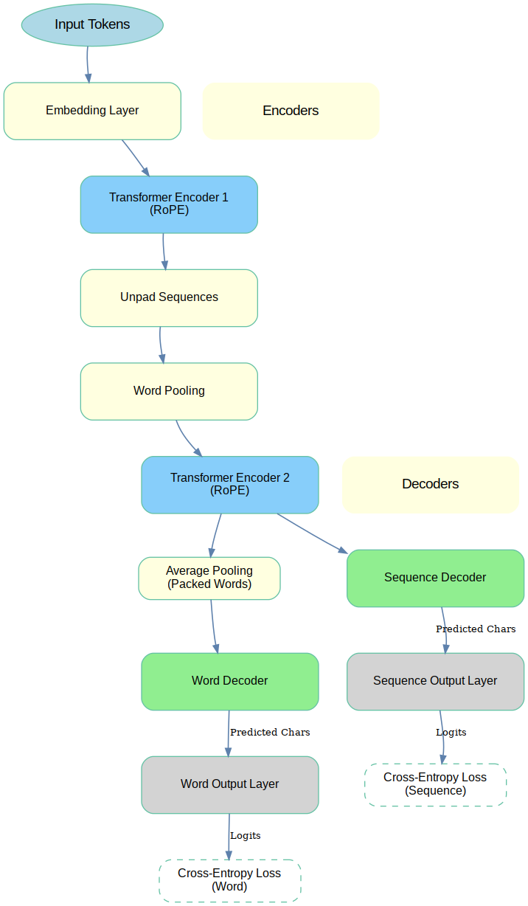

# EncodZall: Masked Denoising Autoencoder

## Overview
EncodZall is a character-level and word-level masked denoising autoencoder.
The architecture features two transformer encoders with sequence packing to improve efficiency and word pooling for latent space representations.
Between the encoders, word-pooling is performed to bottleneck the character embeddings into word embeddings.
Using packed sequences with block diagonal attention masks, we convert character sequences into word-level embeddings.
This enables efficient representations which can learn from character sequences.
After word pooling, the second encoder applies contextual attention for the entire sequence.

In pretraining, we use a dual-decoder with word and sequence decoding objectives.
We also use character and word-level masking to force each set of encoders to apply what can be learnt at each stage.
The word-level decoder will be dropped in the second phase of pretraining, as we switch from byte-length-matched sequences
into a denoising objective that breaks that paradigm. As we drop one reconstruction loss, we plan to add a contrastive objective on the latent space.
The goal is that the autoencoder will learn to organzie the latent space into vector embedding representations, and use the contrastive objective
for consistency regularization.

EncodZall is an experimental transformer architecture that we hope will be a versatile transformer -- able to operate like a BERT model, an embedding model or a sequence to sequence model.

### Model Innovations
- **Sequence Packing**: Input sequences are packed, and the mask restricts attention in Encoder 1 to packed words. These words are pooled per block before being passed to Encoder 2.
- **Masked Pretraining**: Initial training uses character-level and word-level masking. Character-level masking includes individual masks for vowels, consonants, non-whitespace characters, and a general mask that applies to any of these.
- **Reconstruction Losses**: Training objectives include two reconstruction losses (word and sequence).
- **Simulated Noise**: After masked pretraining, the model will be fine-tuned with simulated noise to mimic OCR defects and common mispellings.
- **PID Loop**: A proportional-integral-derivative (PID) loop adjusts the masking and noise strength to maintain a fixed loss during training.

### PID Training
- Using a PID loop offers several potential training benefits:
   - obeservability of training objective saturation
   - quantified denoising "capacity" at various architectural sizes
   - maintaining achievable, challenging training objectives, preventing too hard or too easy objectives

## Architecture
The architecture includes the following components:

1. **Embedding Layer**: Converts input tokens into dense representations.
2. **Transformer Encoder 1 (RoPE)**: Processes packed sequences with restricted attention masks.
3. **Word Pooling**: Pools attention blocks into word-level representations.
4. **Transformer Encoder 2 (RoPE)**: Encodes the pooled representations.
5. **Decoders**:
   - **Sequence Decoder**: Reconstructs the sequence.
   - **Word Decoder**: Reconstructs "word" tokens.

Refer to the diagram below for a visual representation:

  

## Sequence Packing
The sequence packing process ensures efficient computation by minimizing padding. Below is a visualization of the sequence packing mask:

  

## Next Steps
Continued pretraining:
- The word decoder will be dropped.
- A contrastive loss to be added using average-pooled memory embeddings of the latent space.
- Masking switched to realistic denoising objectives (OCR errors, mispellings, ...).

